> 由于在学校带着游戏本跑来跑去又重又不方便，而且续航还短，想到用平板+moonlight串流的方式，把电脑放在宿舍，在平板上连接电脑作为远程桌面。
> 刚开始以为校园网可以作为一个局域网，电脑和平板同时连接校园网就可以串流了，后来发现好像不是这样子，于是使用zerotier来组网（虽然学了计算机网络，但是背后的内网穿透的什么什么原理我还是不懂，想要细究的看别的地方）
> zerotier组网效果还是挺好的，就是在国软教室巨卡无比，而且老是掉线，不知道是什么原因，于是想要说建个服务器作为中转，但是没有找到适配moonlight的教程，于是后来使用了RustDesk作为远程桌面，RustDesk官方文档里就有建立中转服务器的相关教程，也比较简单，效果还是不错的。
> 然而RustDesk感觉不是很适配平板，一是无法连接电脑音频，二是如果平板连接了鼠标，鼠标滚轮只能相应RustDesk自身的滚动条，无法相应远程桌面的滚动条，于是兜兜转转又换回了moonlight。
> 综上所述，本篇教程就是：
### 以Windows服务器作为中转服务器，实现moonlight远程桌面串流（电脑到安卓平板）的教程
> #### 1. 购买服务器
> 这里我是用的腾讯云轻量应用服务器，最便宜的那个，活动价95一年的，下面这个：
> 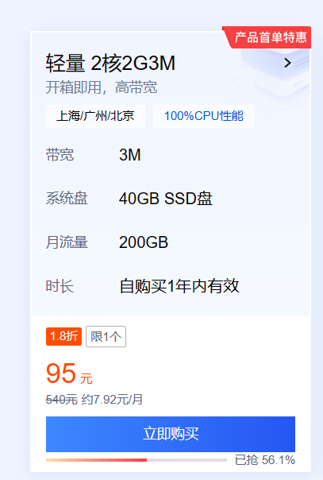
> 具体的使用教程自己去网上找
> #### 2. 在服务器上下载zerotier
> 下载链接如下：https://www.zerotier.com/download/
> 由于我的服务器是Windows Server 2012，这里要下载1.6.6版本的zerotier
> 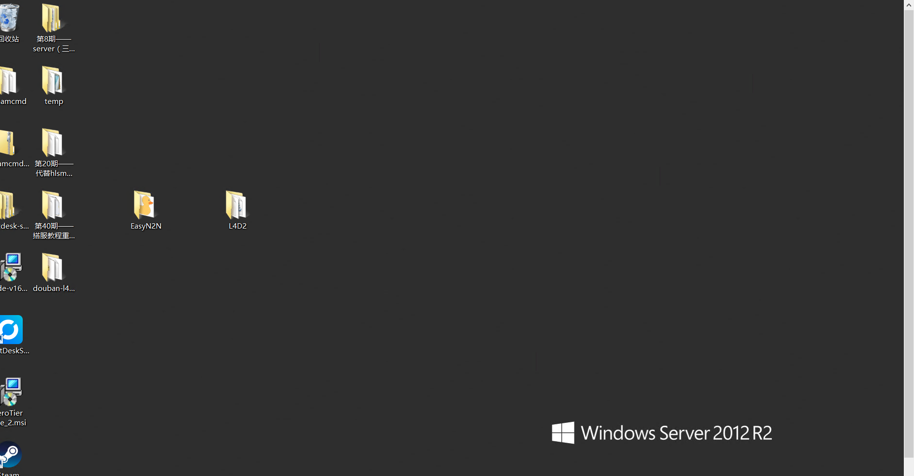
> 原因如下，反正官网说了要下载1.6.6版本的，为什么我也不知道
> 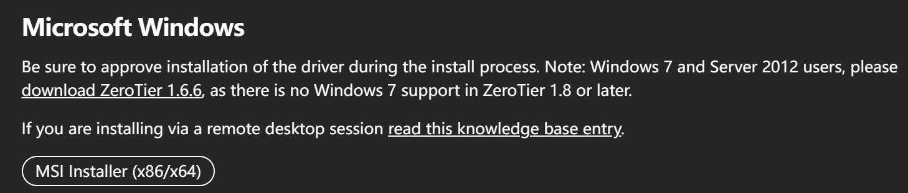
> #### 3. 配置服务端的zerotier
> 可以参考这篇文章：https://codeleading.com/article/32364709264/#google_vignette
> 1. 首先打开cmd（以管理员身份），步骤如下：
> 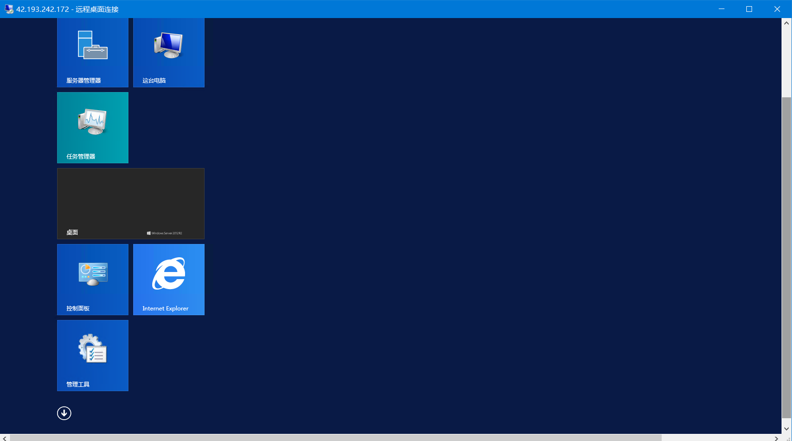
> 按win键打开开始菜单，然后点击上图中左下角的那个箭头按钮进入如下界面：
> 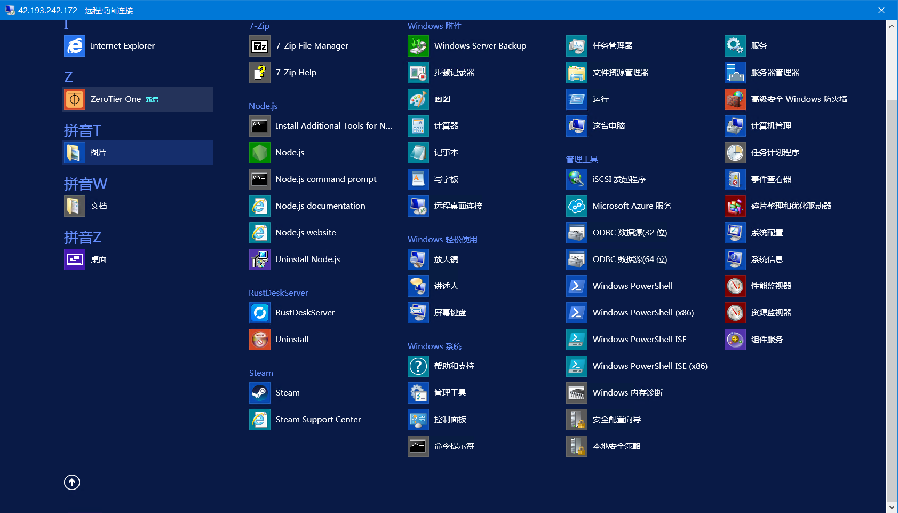
> 右键点击命令提示符，以管理员身份运行
> 2. 在cmd中输入以下命令：
> ```
>CD C:\ProgramData\ZeroTier\One\
>zerotier-one_x64.exe -i 
>```
> 如下图：
> 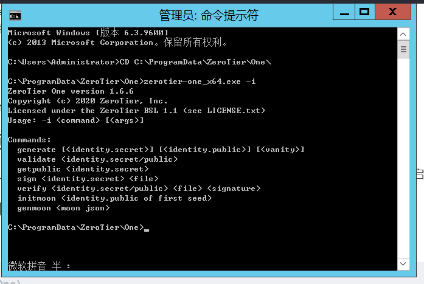
> 3. 修改moon.json
> 如下图：
> 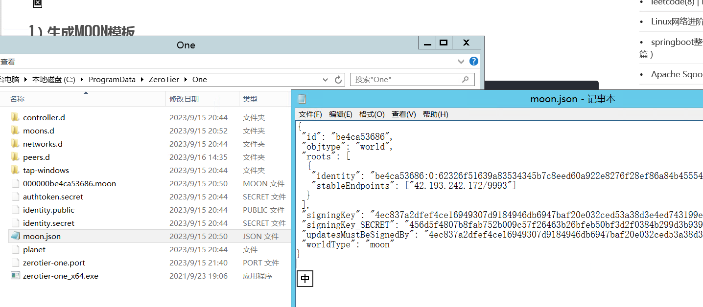
> 修改stableEndpoints字段，改为：
> ```“stableEndpoints”: [ “8.8.8.8/9993” ] #8.8.8.8 改为你的公网IP```
> 4. 生成moon文件
> 再在cmd中输入以下命令：
> ``` zerotier-one_x64.exe -i genmoon moon.json ```
> 然后文件夹中就会生成moon文件，如下图
> 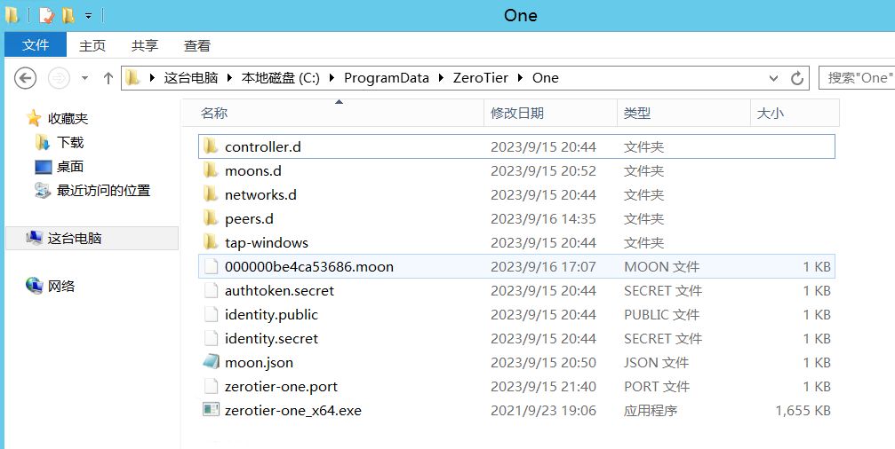
> 然后在C:\ProgramData\ZeroTier\One\目录下建立文件夹 moons.d，将刚刚生成的 .moon 文件拷贝进去。
> 5. 重启zerotier
> 按“WIN+R”键，打开运行窗口，再输入”services.msc”，回车，运行的服务中找到ZeroTier one,选中点击右键，重启服务。
> #### 4. 配置客户端（电脑端）的zerotier
> 以管理员身份运行cmd，输入如下命令
> ```CD C:\ProgramData\ZeroTier\One\```
> ```zerotier-one_x64.exe -q orbit 000000xxxxx 000000xxxxx ```
> 上面的那个000000xxxxx就是moon文件的那个文件名
> 再输入如下命令：
> ```zerotier-one_x64.exe -q listpeers```
> 如果出现如下图所示的结果（对应你服务器ip的那一行，结尾是moon），说明配置成功
> 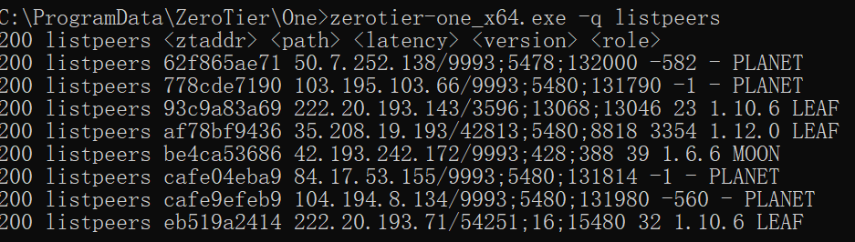
> #### 5. 配置客户端（安卓端）的zerotier
> 参考如下文章：https://zhuanlan.zhihu.com/p/362884740
> 先下载Zerotier FIX，链接：https://github.com/kaaass/ZerotierFix
> 打开Zerotier FIX，点击右上角的三个点，然后再点击设置，如下图
> 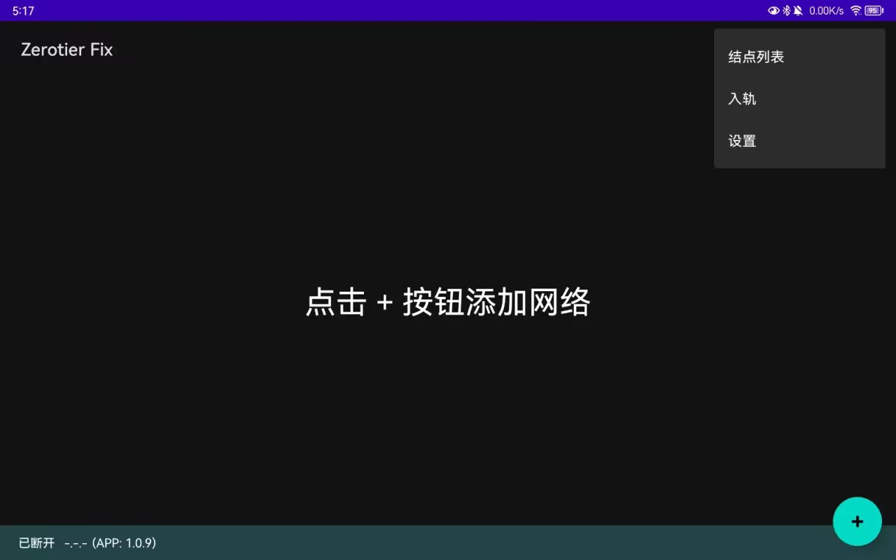
> 启用自定义Planet，导入planet文件（理论上来说，在第3步：配置服务端的zerotier的最后，重启zerotier服务后，C:\ProgramData\ZeroTier\One\中就会出现planet文件，然后传到手机上就可以了，这个教程里的图有些有planet文件有些没有的原因是：我忘记planet文件是哪来的了，删掉重新试的时候发现重启服务就会有了），如下图：
> 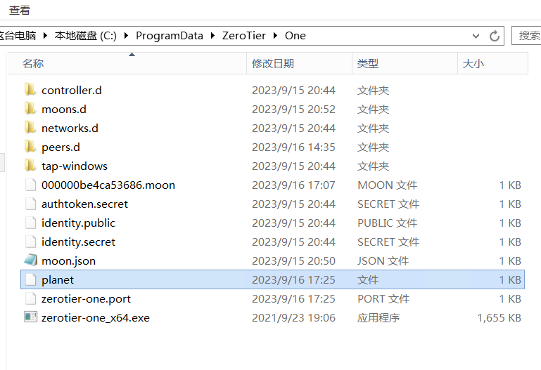
> 然后返回到主界面，再次点击右上角的三个点，点击入轨，导入moon文件（好像可以直接填写，两个都填moon文件的文件名中的最后10位）
> 最后回到主界面，点击右下角的+号添加网络，这一部分网上的教程很多，可以看这个教程：https://www.bilibili.com/read/cv25281688/
> 如果你像我一样，在建立服务器前已经使用过无moon结点的zerotier，并且已经组过网了，那么当你在再次进入同一个网络时可能会报如下错误：
> 这个时候打开zerotier官网并登录，进入组网页面，如下：
> 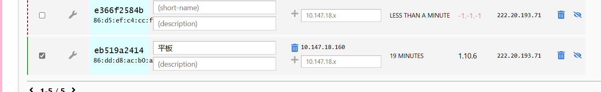
> 把新增结点的auth勾选上即可（就是最右边那个勾选框），然后应该就能连上了
> 再次打开电脑端，输入如下命令：
> ```CD C:\ProgramData\ZeroTier\One\```
> ```zerotier-one_x64.exe -q listpeers```
> 结果如下图：
> 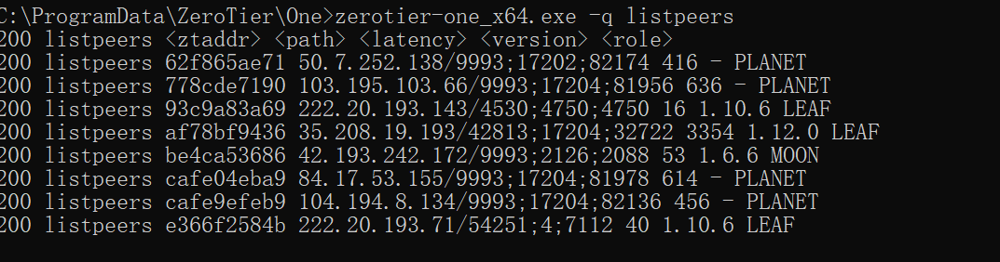
> 这里面有三个LEAF，其中一个是电脑结点，另外两个是安卓结点（都是同一台平板，它们的物理IP是一样的，就是上面那个图显示的，只是因为连了两次网，分配了两个ip）
> 然后应该就能使用了，不过由于我没有设置对照组（没有测试一下不用中转服务器的效果），所以也不知道效果会不会更好，反正我看大伙说上图能显示MOON和LEAF就说明能连了，效果似乎还行，码率30mbps，1080p可以60帧